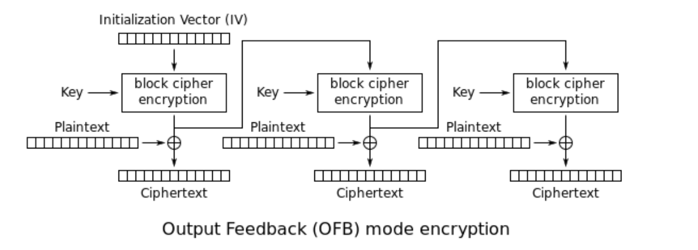

# Foresty Hacker Class - Problems

<!--  -->

"Hacker Class 2023: Get To Know The World Of Hacking Through CTF" merupakan kegiatan yang diselenggarakan oleh Forensics & Security Laboratory yang dapat dijadikan ajang bagi para peserta sekalian dalam belajar dan berlatih untuk mengembangkan kemampuan di bidang Keamanan Siber, terlebih melalui CTF.

## List of Problems:

### Cryptography

- [Vigenere **(Easy)**](#vigenere)
- [RSA **(Easy)**](#rsa)
- [Xorrr **(Medium)**](#xorrr)
- [OFB **(Medium - Hard)**](#ofb)

### Binary Exploitation

- [Shellcode **(Easy)**](#shellcode)
- [TurboLike: Login Portal **(Easy)**](#turbolike-login-portal)
- [TurboChat: Development **(Medium)**](#turbochat-development)
- [TurboSort **(Hard)**](#turbosort-service)
- [Rill or Fekk (Easy)]

## Solutions

### Vigenere

#### Description

You have stumbled upon a suspicious piece of encrypted text. It appears to be encrypted using some cipher. Your task is to decrypt the message and uncover the hidden flag within.

Encrypted Flag: `KciikmwMQ{3q_z1y3gcws_tl1h3k_u1yv_w0v35lr_i3d_t15uis}`

#### Hint

Do you know the organizer of this hacker class? it will help you to find the key.

#### Solution

- Merujuk judul soal, diketahui enkripsi yang digunakan adalah `vigenere`.
- Pada `vigenere` cipher, dibutuhkan key.
- Jika dilihat pada hint, key yang digunakan adalah `foresty` yaitu nama penyelenggara event ini
- Sebenarnya dari format flag dapat diketahui key yang dipakai untuk enkripsi. Yaitu dengan melakukan dekripsi dengan key adalah plaintext yang sudah diketahui
- Selanjutnya tinggal dekripsi dengan key yang sudah didapatkan.

### RSA

#### Description

I just hacked the foresty server, and found hidden files on it. However, the file is still encrypted and should be crackable with some encryption scheme. Can you help me to decrypt this file?

#### Solution

Baca [disini](https://id.wikipedia.org/wiki/RSA) untuk referensi perhitungan RSA.

- Diberikan sekumpulan bilangan `p`, `q`, `n`, `e`, dan `c`.
  - `p` dan `q` adalah pasangan bilangan prima,
  - `n` adalah modulus yang dihasilkan dari perkalian `p` dan `q`,
  - `e` adalah eksponen,
  - `c` adalah ciphertext hasil enkripsi flag.
- Bilangan prima `p` dan `q` sudah didapatkan, sehingga tidak perlu pusing-pusing mencarinya :)
- Kalkulasi nilai `totient` dengan `(p - 1)(q - 1)`
- Inverse modulus `e` dan `totient` sehingga didapatkan `d`
- Selanjutnya dekripsi ciphertext menggunakan private key yang sudah didapatkan (`d`)
- Konversi ke bentuk bytes untuk mendapatkan representasi flag yang dapat dibaca.

### Xorrr

#### Description

Still remember last night?

`355c111740002628673f08580617432b36056c14425d072d6c0c6f196c10006c111745472d185a1b1f563c4055156e590704`

#### Solution

Merujuk pada attachment yang diberikan, didapatkan:

- Flag berawalan dengan `ForestyCTF`
- Panjang key adalah 10 bytes
- Fungsi `encrypt`:
  - Setiap byte pada plaintext akan di-xor dengan suatu key
  - Lalu hasil xor akan di konversi ke bentuk hexadesimal.

Sehingga dapat dilakukan:

- Untuk mendapatkan key, xor 10 bytes pertama dari ciphertext dengan format flag yang sudah diketahui `ForestyCTF`
- Selanjutnya tinggal xor keseluruhan ciphertext dengan key yang didapatkan

### OFB

#### Description

Oh no! Someone just sent me some suspicious file, and I accidentally opened it. Suddenly, all my files are encrypted. Fortunately, I have backed up one of the encrypted files and found this when I tried to reverse the file.

```py
def encrypt(plaintext):
    cipher = AES.new(KEY, AES.MODE_OFB, IV)
    ciphertext = cipher.encrypt(pad(plaintext, AES.block_size))
    return ciphertext
```

Can you help me recover my files?

#### Hint

Take a look at how ofb encryption works. Figure out how to get the keystream with a pair of plaintext ciphertext in hand.

#### Solution

Merujuk pada hint yang diberikan, tentang bagaimana OFB mengenkripsi plaintext



- OFB akan melakukan enkripsi terhadap KEY dan IV, lalu hasilnya akan di `xor` dengan plaintext
- Misalkan hasil enkripsi KEY dan IV itu adalah keystream
- Maka untuk mendapatkan keystream, dapat dilakukan dengan melakukan xor antara plaintext dan ciphertext
- Dan tinggal xor antara ciphertext dan keystream untuk mendapatkan plaintext asli.

Jadi untuk dapat melakukan dekripsi `flag.png.enc`,

- Lakukan xor antara `banner.png.enc` dengan `banner.png` hasilnya didapatkan keystream
- Lalu xor `flag.png.enc` dengan keystream yang didapat
- Hasilkan didapatkan `flag.png` yang memuat flag

### TurboLike: Login Portal

#### Description

I just create login service for my new TurboLike v1.0 app. Could you hack this service for me?

`nc 103.167.136.89 10020`

#### Hint

One of the vulnerable functions mentioned in the meet was `gets` right? Now, find a way how do we get the admin `uid`.

#### Solution

- Terdapat Buffer Overflow pada saat input `name` karena inputan diambil menggunakan fungsi `gets()` yang vulnerable.
- Struktur `User` memiliki 64 bytes char `name` dan integer `uid`.
- Overwrite nilai `uid` dengan input `name` lebih dari 64 bytes.
- Karena `uid` bertipe integer, yang mana berukuran 4 bytes, maka payload yang akan dikirimkan: `[64 bytes buffer name]` + `[4 bytes admin uid]`
- Dan jangan lupa representasi `little endian` untuk admin uid.

### TurboChat: Development

#### Description

I've create some chat service, but the main fiture is not done yet. However the server is already up and you can try it to test your connection.

`nc 103.167.136.89 10021`

#### Hint

`ret2win` and using `ret` instruction to bypass stack alignment error.

#### Solution

- Binary tidak terdapat proteksi `stack cookie` atau `canary`; dan `PIE` disabled yang artinya base address binary akan `fixed`.
- Terdapat Buffer Overflow pada saat input pesan yang akan dikirimkan ke server (`ping message`), karena menggunakan parameter `scanf` dengan panjang inputan tidak dibatasi (`%s`).
- Karena `ping message` disimpan pada stack dan tidak terdapat proteksi `canary`, maka tinggal overwrite `RIP` menuju ke fungsi `win` untuk mendapatkan shell.
- Bypass stack alignment error seperti: `movaps xmmword ptr [rsp + 0x50], xmm0` dengan menggunakan gadget `ret` sebelum return ke fungsi `win`.
- Sehingga payload yang disusun: `[buffer]` + `[ret]` + `[win]`

### Shellcode

#### Description

Could you execute some shell on this shellcode tester app with no restriction?

`nc 103.167.136.89 10023`

#### Hint

Have you ever heard about `execve("/bin/sh", 0, 0)` ?

#### Solution

- Ada banyak cara. Cara paling gampang dengan kirimkan shellcode `execve("/bin/sh", 0, 0)` untuk mendapatkan shell.
- Instruksi assembly untuk `execve("/bin/sh", 0, 0)`:
  ```ams
  mov rax, 0x68732f6e69622f
  push rax
  mov rdi, rsp
  xor rsi, rsi
  xor rdx, rdx
  mov rax, 0x3b
  syscall
  ```
- Solusi lain yang lebih gampang, shellcode sudah ada dari `pwntools` dengan `r.sendline(asm(shellcraft.sh()))` akan mendapatkan shell.

### TurboSort: Service

I just create some sorting app implementing bubble sort algorithm. As a pwner, could you find where is the bug and report it to me?

NOTE: I think this is the hardest problem in this category :)

`nc 103.167.136.89 10022`

#### Description

#### Hint

Did you see the commented part in the source code?

#### Solution

- Commented part in the source code:
  ```c
  #define MAX_NUMBER 20
  ...
  unsigned long num[MAX_NUMBER];
  ...
  scanf("%d", &num_size);
  ...
  // if (num_size > 20) {
  //     puts("Sorry, we can only sort 20 numbers at a time.");
  //     exit(1);
  // }
  input_numbers(num, num_size);
  ```
- Seharusnya kode diatas memberitahu kita bahwa tidak ada pengecekan panjang bilangan yang akan dimasukkan user, sedangkan panjang array dari `num` sendiri hanya 20.
- Dengan input `num_size` lebih dari 20, maka akan menyebabkan array index `out-of-bound` pada input bilangan yang dapat meng-overwrite isi stack setelah variable `num` (salah satunya adalah `RIP`).
- Lakukan `Return-oriented programming (ROP)` untuk melakukan leak alamat libc dan `ret2libc` dengan memanggil `system("/bin/sh")` untuk mendapatkan shell.
- _Lalu bagaimana dengan sortingnya? Bagaimana jika payload yang kita susun nilai nya tidak berurutan? Bukannya itu akan menyebabkan payload kita rusak?_
- Karena kita dapat melakukan sort lebih dari satu kali, maka kita bisa bypass sorting itu dengan menyusun payload dari belakang. Seperti ini:

  ```
  Payload: [..., 1337, 1339, 1338]
  ---
  Sort 1: [..., x, x, 1338]
  Sort 2: [..., x, 1339]
  Sort 3: [..., 1337]
  ---
  Result Stack: [..., 1337, 1339, 1338]

  Yaitu, dengan `x` adalah bilangan yang kurang dari payload yang akan kita kirim.
  ```

- Payload `ROP` untuk melakukan leak alamat libc: `[buffer]` + `[pop rdi ; ret]` + `[puts@GOT]` + `[puts@SYMBOL]` + `[main]`
- Payload `ret2libc`: `[buffer]` + `[pop rdi ; ret]` + `[alamat "/bin/sh"]` + `[system]`
