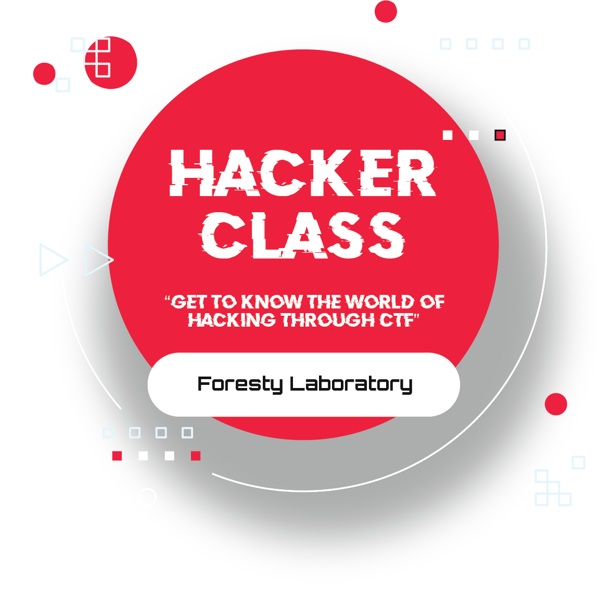

# Foresty Hacker Class - Problems

"Hacker Class 2023: Get To Know The World Of Hacking Through CTF" merupakan kegiatan yang diselenggarakan oleh Forensics & Security Laboratory yang dapat dijadikan ajang bagi para peserta sekalian dalam belajar dan berlatih untuk mengembangkan kemampuan di bidang Keamanan Siber, terlebih melalui CTF.

## List of Problems:

1. Cryptography
   - Vigenere (Easy)
   - RSA (Easy)
   - Xorrr (Medium)
   - OFB (Medium - Hard)
2. Binary Exploitation
   - TurboLike: Login Portal (Easy)
   - TurboChat: Development (Medium)
   - TurboSort (Hard)
